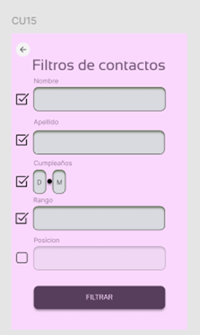
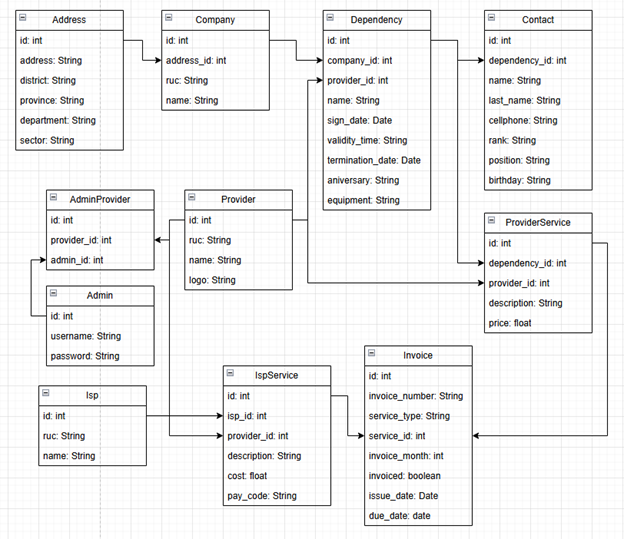

# 2025-1 Programación Movil - Proyecto - Proveedify

*<b>Figura 1:</b> Logo de Proveedify*

La aplicación Proveedify tiene como objetivo centralizar y optimizar la gestión financiera de múltiples empresas, permitiendo a los administradores visualizar resúmenes de ingresos y egresos, consultar servicios por facturar, registrar nuevos servicios, y gestionar información de empresas, dependencias y contactos. A través de una interfaz móvil intuitiva y el consumo de servicios API, Proveedify facilita el control eficiente de datos financieros y administrativos, asegurando acceso seguro, búsqueda personalizada de registros y generación de reportes exportables en formatos estándar como PDF y Excel.

- [Configuración del Ambiente de Desarrollo](#configuración-del-ambiente-de-desarrollo)
- [Diagrama de Despliegue](#diagrama-de-despliegue)
- [Requerimientos No Funcionales](#requerimientos-no-funcionales)
- [Diagrama de Casos de Uso](#diagrama-de-casos-de-uso)
    - [Descripción de Casos de Uso](#descripción-de-casos-de-uso)

## Configuración del Ambiente de Desarrollo

### Android Studio
Android Studio es el IDE oficial de Google para desarrollar aplicaciones Android. Incluye todas las herramientas necesarias: editor de código, emulador de dispositivos, Android SDK y más. Se utiliza como entorno de compilación para ejecutar y probar aplicaciones Flutter.

#### 1. Descargar Android Studio desde la página oficial de Android Studio:
 https://developer.android.com/studio.

*<b>Figura 2:</b> Pagina web de Android Studio*

#### 2. Instalar Android Studio en Windows.

*<b>Figura 3:</b> Instalación de Android Studio*

#### 3. Dentro de Android Studio, instalar los siguientes SDK Tools

*<b>Figura 4:</b> Instalación de SDK Tools*

### Flutter

Flutter es un framework de Google para crear aplicaciones nativas para iOS y Android desde un solo código base usando Dart.

#### 1. Descargar Flutter desde la pagina oficial de Flutter. https://docs.flutter.dev/get-started/install/windows/desktop

*<b>Figura 5:</b> Descarga de Flutter SDK*

#### 2. Descomprimir el archivo zip y agregar la ruta a la carpeta bin a las variables del entorno del sistema.

*<b>Figura 6:</b> Agregación de la carpeta bin a variables de entorno del sistema*

#### 3. Aceptar licencias de android en Flutter usando el comando: flutter doctor --android-licenses

*<b>Figura 7:</b> Aceptación de licencias de android en Flutter*

## Diagrama de Despliegue

La arquitectura a usar será una aplicación móvil y una aplicación web tipo API. La aplicación móvil accederá a la API desarrollada en Ruby a través de Internet, mientras que la API se encargará de consultar y almacenar datos en la base de datos en Replit.
Este modelo, ilustrado en la imagen de abajo, muestra cómo los clientes interactúan con la aplicación móvil Flutter y cómo se gestionan los datos mediante la API Ruby y la base de datos alojada en Replit.

*<b>Figura 8:</b> Diagrama de despliegue*

## Requerimientos No Funcionales

A continuación se presentan los principales requerimientos no funcionales de la aplicación de control financiero para empresas administradas, junto con las consideraciones necesarias para su cumplimiento efectivo.

## Seguridad
- **RNF01**: El sistema debe autenticar a los administradores mediante un nombre de usuario y contraseña. Para ello, se implementará un endpoint `/login` en Ruby, que será consumido por la aplicación Flutter mediante solicitudes POST.
  
- **RNF02**: Las contraseñas de los administradores deberán ser almacenadas cifradas utilizando el algoritmo bcrypt en Ruby, asegurando la protección de las credenciales sensibles.

- **RNF03**: Todas las comunicaciones entre la aplicación móvil y la API deben realizarse utilizando HTTPS. Se empleará exclusivamente la URL pública segura proporcionada por Replit (`https://...`) para proteger los datos transmitidos.

- **RNF04**: El sistema deberá implementar control de acceso mediante tokens de sesión. Tras un login exitoso, el servidor generará un token que deberá ser enviado en cada solicitud posterior desde Flutter, validando así la autenticidad de las operaciones.

## Disponibilidad
- **RNF05**: Se establecerá una disponibilidad mínima del 95% mensual para el servidor API alojado en Replit, considerando las características de la plataforma gratuita utilizada.

- **RNF06**: La aplicación móvil deberá gestionar adecuadamente las caídas de conexión o errores en la red, mostrando mensajes amigables al usuario y ofreciendo la opción de reintentar la operación fallida.

## Rendimiento
- **RNF07**: Las operaciones de consulta (GET) deberán devolver una respuesta en menos de 3 segundos, optimizando consultas y controlando la cantidad de datos devueltos.

- **RNF08**: Las operaciones de creación o actualización de datos (POST/PUT), como registrar nuevos servicios o facturar, deberán ejecutarse en un tiempo inferior a 5 segundos para mantener la fluidez de la aplicación.

- **RNF09**: La generación de reportes en formatos PDF o Excel deberá completarse en menos de 7 segundos. Para lograrlo, se realizará el proceso de exportación de archivos directamente en la aplicación Flutter utilizando paquetes como `pdf` y `excel`.

## Usabilidad
- **RNF10**: La interfaz de usuario debe ser intuitiva y sencilla de utilizar. Se implementarán diseños claros, navegación fluida y componentes accesibles para asegurar una experiencia positiva.

- **RNF11**: Toda acción crítica que implique cambios importantes en el sistema, como la facturación de servicios, deberá requerir confirmación explícita mediante cuadros de diálogo (`AlertDialog`) en Flutter.

## Compatibilidad
- **RNF12**: La aplicación móvil deberá ser compatible con dispositivos Android con versión 9.0 (Pie) o superior, configurando adecuadamente el archivo `build.gradle` del proyecto Flutter.

- **RNF13**: Los archivos exportados en formato PDF o Excel deberán ser compatibles con aplicaciones estándar de visualización de documentos como Google Drive, Microsoft Office Mobile y WPS Office.

## Portabilidad
- **RNF14**: El sistema deberá adaptarse de forma automática a diferentes tamaños de pantalla, tanto de smartphones como de tablets, utilizando componentes responsivos de Flutter como `MediaQuery`, `Flexible` y `LayoutBuilder`.

## Mantenibilidad
- **RNF15**: El código de la aplicación y de la API deberá seguir un enfoque modular, organizando controladores, servicios, modelos y vistas en estructuras claras de carpetas y archivos.

- **RNF16**: La base de datos debe garantizar la integridad referencial mediante la definición de claves foráneas (`FOREIGN KEY`) en las tablas relacionadas, asegurando así la consistencia de los datos.

## Diagrama de Casos de Uso

El siguiente diagrama de casos de uso representa las principales interacciones dentro de la Aplicación de Control Financiero para Empresas Administradas, basada en el modelo de datos definido previamente. En este sistema, el Administrador puede iniciar sesión, seleccionar una empresa o proveedor para trabajar, consultar resúmenes financieros, realizar búsquedas personalizadas, exportar reportes y gestionar servicios a facturar.

Además, el administrador tiene permisos para registrar nuevos servicios o bienes, así como visualizar las empresas, dependencias y contactos asociados. Estas funcionalidades permiten organizar de manera clara y eficiente la información financiera, asegurando el control de ingresos y egresos en distintas entidades de forma centralizada, desde una plataforma móvil de fácil uso.

*<b>Figura 9:</b> Diagrama de casos de uso*

### Descripción de casos de uso

A continuación se detallan los casos de uso:

| Concepto                       | Descripción                                                                                                                                                                                                                                                                 |
|--------------------------------|-----------------------------------------------------------------------------------------------------------------------------------------------------------------------------------------------------------------------------------------------------------------------------|
| *CU1* | Login de administrador                                                                                                                                                                                        |
| *Descripción*                | El administrador debe ingresar un nombre de usuario y contraseña válidos para acceder a la aplicación. |
| *Vista*                      |                                                                                                                                                              
|

| Concepto                       | Descripción                                                                                                                                                                                                                                                                 |
|--------------------------------|-----------------------------------------------------------------------------------------------------------------------------------------------------------------------------------------------------------------------------------------------------------------------------|
| *CU2* | Seleccionar empresa/proveedor                                                                                                                                                                                       |
| *Descripción*                | Luego del login exitoso, el administrador puede seleccionar la empresa o proveedor registrado con el que desea trabajar.| 
|*Vista*                      |                                                                                                                                                              
|

| Concepto                       | Descripción                                                                                                                                                                                                                                                                 |
|--------------------------------|-----------------------------------------------------------------------------------------------------------------------------------------------------------------------------------------------------------------------------------------------------------------------------|
| *CU3* | Visualizar resumen financiero                                                                                                                                                                                    |
| *Descripción*                | El sistema permitirá visualizar el resumen financiero de la empresa seleccionada, mostrando los ingresos, egresos y saldos actuales a partir de los datos consolidados en el sistema.|
| *Vista*                  |                                                                                                          
|

| Concepto                       | Descripción                                                                                                                                                                                                                                                                 |
|--------------------------------|-----------------------------------------------------------------------------------------------------------------------------------------------------------------------------------------------------------------------------------------------------------------------------|
| *CU4* | Realizar búsqueda personalizada                                                                                                                                                                                     |
| *Descripción*                | El administrador podrá realizar búsquedas personalizadas, filtrando registros por diversos criterios como nombre de dependencia, RUC, fecha, ISP, descripción del servicio, monto, entre otros.|
| *Vista*                      |                                                                                                                                                              
|

| Concepto                       | Descripción                                                                                                                                                                                                                                                                 |
|--------------------------------|-----------------------------------------------------------------------------------------------------------------------------------------------------------------------------------------------------------------------------------------------------------------------------|
| *CU5* | Ver resultados de la búsqueda                                                                                                                                                                                    |
| *Descripción*                | Los resultados de la búsqueda se presentarán de manera tabular y ordenada, facilitando su lectura y análisis.|
| *Vista*                      |                                                                                                                                                              
|

| Concepto                       | Descripción                                                                                                                                                                                                                                                                 |
|--------------------------------|-----------------------------------------------------------------------------------------------------------------------------------------------------------------------------------------------------------------------------------------------------------------------------|
| *CU6* | Exportar reporte en Excel o PDF                                                                                                                                                                                    |
| *Descripción*                | El sistema permitirá exportar los datos filtrados o visualizados en formatos Excel o PDF para su uso externo.|
| *Vista*                      |                                                                                                                                                              
|

| Concepto                       | Descripción                                                                                                                                                                                                                                                                 |
|--------------------------------|-----------------------------------------------------------------------------------------------------------------------------------------------------------------------------------------------------------------------------------------------------------------------------|
| *CU7* | Compartir reporte                                                                                                                                                         |
| *Descripción*                | Los reportes generados podrán ser compartidos mediante aplicaciones como WhatsApp, correo electrónico, Teams, entre otras plataformas de mensajería.|
| *Vista*                      |                                                                                                                                                              
|

| Concepto                       | Descripción                                                                                                                                                                                                                                                                 |
|--------------------------------|-----------------------------------------------------------------------------------------------------------------------------------------------------------------------------------------------------------------------------------------------------------------------------|
| *CU8* | Consultar servicios a facturar                                                                                                                                                                          |
| *Descripción*                | El administrador podrá consultar los servicios registrados que deben ser facturados en el periodo activo.|
| *Vista*                      |                                                                                                                                                              
|

| Concepto                       | Descripción                                                                                                                                                                                                                                                                 |
|--------------------------------|-----------------------------------------------------------------------------------------------------------------------------------------------------------------------------------------------------------------------------------------------------------------------------|
| *CU9* | Facturar Servicios                                                                                                                                                                     |
| *Descripción*                | Se permitirá marcar uno o más servicios como facturados, actualizando su estado en el sistema para llevar un control efectivo de la facturación.|
| *Vista*                      |                                                                                                                                                              
|

| Concepto                       | Descripción                                                                                                                                                                                                                                                                 |
|--------------------------------|-----------------------------------------------------------------------------------------------------------------------------------------------------------------------------------------------------------------------------------------------------------------------------|
| *CU10* | Registrar nuevo servicio-bien                                                                                                                                                                |
| *Descripción*                | El sistema permitirá registrar nuevos servicios o bienes, asociándolos a un proveedor o a un ISP, incluyendo su descripción y precio correspondiente.|
| *Vista*                      |                                                                                                                                                              
|

| Concepto                       | Descripción                                                                                                                                                                                                                                                                 |
|--------------------------------|-----------------------------------------------------------------------------------------------------------------------------------------------------------------------------------------------------------------------------------------------------------------------------|
| *CU11* | Visualizar empresas                                                                                                                                                                    |
| *Descripción*                | El administrador podrá visualizar el listado de empresas registradas en el sistema, junto con sus datos generales como nombre, RUC y sector económico.|
| *Vista*                      |                                                                                                                                                              
|

| Concepto                       | Descripción                                                                                                                                                                                                                                                                 |
|--------------------------------|-----------------------------------------------------------------------------------------------------------------------------------------------------------------------------------------------------------------------------------------------------------------------------|
| *CU12* | Visualizar dependencias de empresas                                                                                                                                                                    |
| *Descripción*                | Se podrá consultar el listado de dependencias asociadas a una empresa específica seleccionada previamente.|
| *Vista*                      |                                                                                                                                                              
|

| Concepto                       | Descripción                                                                                                                                                                                                                                                                 |
|--------------------------------|-----------------------------------------------------------------------------------------------------------------------------------------------------------------------------------------------------------------------------------------------------------------------------|
| *CU13* | Visualizar contactos de dependencias                                                                                                                                                            |
| *Descripción*                | Además, será posible visualizar los contactos asignados a cada dependencia, incluyendo su nombre, cargo, número de celular y fecha de cumpleaños.   | 
|*Vista*                      |                                                                                                                                                              
|

| Concepto                       | Descripción                                                                                                                                                                                                                                                                 |
|--------------------------------|-----------------------------------------------------------------------------------------------------------------------------------------------------------------------------------------------------------------------------------------------------------------------------|
| *CU14* | Filtrar dependencias                                                                                                                                                           |
| *Descripción*                | El sistema permitirá aplicar filtros específicos sobre los registros de dependencias, utilizando campos como nombre, fechas de firma o de terminación, y equipamiento. | 
|*Vista*                      |                                                                                                                                                              
|

| Concepto                       | Descripción                                                                                                                                                                                                                                                                 |
|--------------------------------|-----------------------------------------------------------------------------------------------------------------------------------------------------------------------------------------------------------------------------------------------------------------------------|
| *CU15* | Filtrar contactos                                                                                                                                                           |
| *Descripción*                | También será posible aplicar filtros sobre los registros de contactos, permitiendo búsquedas por nombre, apellido, celular, rango, cargo o fecha de cumpleaños.| 
|*Vista*                      |                                                                                                                                                              
|

Y el diagrama de clases es el siguiente:

*<b>Figura 10:</b> Diagrama de casos de clases*
